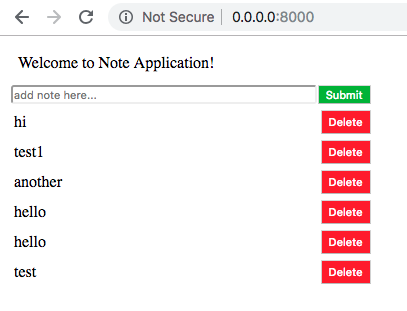

# Notepad+++

[live demo](https://whispering-bayou-74902.herokuapp.com/)

## Features
* Users can add a note.
* Notes are parsed for plain text and stored if entered in HTML, or directly stored if entered as plain text.
* Users may delete individual notes.

One of the key components of the notes application is the add_note method. Most important, I chose to use BeautifulSoup from BS4 to parse out text from HTML as it is posted to Postgres. Otherwise, if I save the HTML note to Postgres, I would have to parse the note every time I display the index, which would be less efficient. 

Elements (notes) are pushed into the array in order from newest to oldest so that the index.html template will display in order. 
```python
def add_note(request):
    context = RequestContext(request, {})
    queryset = Note.objects.all()
    arr = []
    for element in queryset:
        arr.insert(0, element)

    if request.method == 'POST':
        note = BeautifulSoup(request.POST['note']).get_text()
        date = datetime.datetime.now()
        obj = Note(note_text=note, pub_date=date)
        obj.save()
        return render(request, 'index.html', {'arr': arr})
    return render(request, 'index.html', {'arr': arr})
```

I chose to store querried notes from the QuerySet in an array for each of my methods. Once the database is changed, whether through a delete (delete_note) or post (add_note), the queryset is changed accordingly and the elements are pushed to the array on refresh. 
```python
def delete_note(request, pk):
    context = RequestContext(request, {})
    Note.objects.get(id=pk).delete()
    queryset = Note.objects.all()
    arr = []
    for element in queryset:
        arr.insert(0, element)
    if request.method == 'POST':
            arr = []
            for element in queryset:
                arr.insert(0, element)
            return render(request, 'index.html', {'arr': arr})
```
# Demo image


